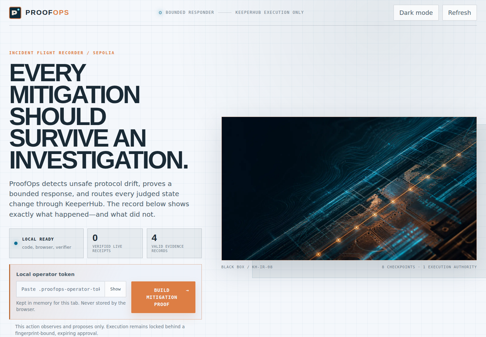

# ProofOps

**A bounded DeFi incident responder with an Incident Flight Recorder.**

ProofOps observes protocol drift, selects a typed mitigation, enforces policy in
deterministic code, simulates and executes through KeeperHub, reconciles an
ambiguous network outcome, verifies post-state, and exports a tamper-evident
proof bundle.

> Every mitigation should survive an investigation.

[](.github/workflows/ci.yml)
[](docs/release-checklist.md)
[](contracts/test)
[](LICENSE)



## The 90-second judge path

1. Open the [judge guide](docs/judge-guide.md) and start the local console.
2. Inspect the eight-stage execution rail: **observe → drift → policy → approve
   → simulate → execute → reconcile → verify**.
3. Select the simulation-blocked receipt. It proves an unsafe call stopped
   before broadcast.
4. Select the retry-recovery receipt. It shows the same intent and idempotency
   key surviving an interrupted submission.
5. Build and approve an exact-action mitigation, then download the JSON proof.
6. Run `corepack pnpm run verify:proof` to validate every SHA-256 digest independently.

The fixture journey is fully reproducible without credentials and never claims
a transaction. The strict release gate unlocks only after it finds a real
KeeperHub execution ID, transaction hash, matching explorer URL, KeeperHub audit
URL, and verified post-state.

## Why this matters

Onchain agents usually stop at “I chose an action.” Production incident response
fails later: the recommendation was unsafe, simulation used a different intent,
the network timed out after broadcast, a retry duplicated the write, or nobody
could reconstruct what happened.

ProofOps treats that last mile as the product:

| Failure | ProofOps control | Evidence produced |
| --- | --- | --- |
| Manipulated recommendation | finite runbooks + deterministic allowlist, caps, cooldown | policy verdict and reason code |
| Stale human approval | 15-minute SHA-256 binding to the exact action | approval ID, digest, expiry |
| Reverting mitigation | KeeperHub dry-run of the same intent | simulation receipt, zero submissions |
| Drift changes before execution | KeeperHub atomic check-and-execute | condition value and terminal outcome |
| Interrupted submission | same body + same idempotency key, then reconcile | attempt timeline and request IDs |
| Ambiguous timeout | poll original execution before any new intent | one canonical execution result |
| False demo claim | fixture/live schema invariants | no live link or confirmed status for fixtures |
| Altered audit export | manifest of per-file SHA-256 digests | independently verifiable proof bundle |

## KeeperHub is load-bearing

ProofOps has no local signer in its judged execution path. KeeperHub provides the
managed wallet, simulation boundary, conditional execution, idempotent
submission, terminal status, and authoritative audit reference.

```text
independent read
      │
      ▼
typed runbook ──► deterministic policy ──► exact human approval
                                               │
                                               ▼
KeeperHub simulate/check ──► execute ──► reconcile terminal receipt
                                               │
                                               ▼
independent post-state ──► proof bundle ──► KeeperHub ActionLog anchor
```

Removing KeeperHub removes execution, recovery, and the authoritative audit
trail; what remains is only a detector. See the
[architecture](docs/architecture.md) and
[KeeperHub integration notes](docs/keeperhub.md).

## Evidence truth model

| Label | Meaning | Can count as a live transaction? |
| --- | --- | --- |
| `FIXTURE` | deterministic offline rehearsal | no |
| `MIXED` | fixture observation with genuine execution metadata | only after strict receipt validation |
| `LIVE` | independent observation and KeeperHub execution | yes, with a complete bound receipt |

Current repository evidence is **144 valid runs, 8 quarantined legacy rows, and
2 verified live KeeperHub executions**. The primary live receipt is independently
bound to a Sepolia transaction, KeeperHub audit reference, and verified
post-state. Inspect the sanitized, digest-bound
[public receipt ledger](docs/evidence/verified-live-receipts.json) or the
generated [reliability report](docs/reliability-report.md).

## Run it

Requirements: Node 20+, corepack pnpm, and Foundry. Python 3 plus Chrome/Chromium are
needed only for the real-browser acceptance test.

```bash
cp .env.example .env
corepack pnpm install --frozen-lockfile
corepack pnpm run verify:local
corepack pnpm run demo:server
```

The server prints a local operator-token path. Open
`http://127.0.0.1:3847`, paste that token into the console, and follow the
judge path. The dashboard is read-only until an authenticated operator builds a
proposal; only the dedicated approval route can authorize execution.

Container path:

```bash
docker compose up --build
```

Fixture-only first-transaction walkthrough:

```bash
corepack pnpm run first-tx -- --fixture
```

For a real organization key and testnet transaction, use the
[live runbook](docs/live-runbook.md). Do not place a credential on a command
line, in a screenshot, or in evidence.

## Proof bundle

```bash
corepack pnpm run export:proof
corepack pnpm run verify:proof
```

`data/proof-bundle/manifest.json` binds the machine-readable bundle, human
report, verification result, and archival HTML. An optional `ActionLog`
attestation records the manifest digest through KeeperHub; it never uses a
local key.

## Engineering evidence

- 116 passing Vitest tests and two credential-gated live tests
- 11 passing Foundry contract tests
- real Chromium acceptance at 1440×1000, 390×844, and 320×800
- authentication, origin, body-size, content-type, redaction, and fixture-link
  browser assertions
- live official KeeperHub MCP initialization, tool discovery, and read-only
  marketplace search validation
- lockfile-bound production dependency audit with zero known vulnerabilities
- multi-stage non-root container with a read-only Compose runtime
- CI gates for TypeScript, contracts, browser, secrets, container, and release
- focused [first reliable transaction starter](keeperhub-first-reliable-tx/README.md)
  plus a reproducible [onboarding friction log](docs/FRICTION_LOG.md)

Run the authoritative local gate:

```bash
corepack pnpm run release:gate -- --local
```

The strict form, `corepack pnpm run release:gate`, additionally requires the real
transaction and public submission URLs.

## Repository map

| Path | Purpose |
| --- | --- |
| `src/agent` | drift orchestration, finite runbooks, policy, exact approvals |
| `src/keeperhub` | current REST contract, reliable execution, audit retrieval |
| `src/observe` | independent RPC/Blockscout reads and post-state verification |
| `src/evidence` | truth-typed records, quarantine, aggregation, proof integrity |
| `src/demo` | authenticated operator API and static console server |
| `contracts` | incident fixture and proof-anchor contracts with Foundry tests |
| `app/dashboard` | Incident Flight Recorder web application |
| `tests/browser` | real-browser judge journey |
| `keeperhub-first-reliable-tx` | standalone five-minute onboarding artifact |
| `docs` | architecture, reliability, security, judge, demo, and live runbooks |

## Submission status

- [x] Product, tests, dashboard, proof export, CI, container, and local release
  gate implemented
- [x] Judge guide, demo script, shot list, onboarding artifact, and security
  model packaged
- [x] Record and validate real KeeperHub transactions, including independent post-state
- [x] Publish the repository at [`Anand-0038/proofops`](https://github.com/Anand-0038/proofops)
- [ ] Publish the hosted console and under-three-minute video
- [ ] Run the strict release gate with those public URLs

The remaining rows require hosting/video work and a durable public proof
location for the optional ActionLog anchor. Fixture evidence cannot satisfy
the live receipt gate. The exact handoff is in
[DEPLOYMENTS.md](DEPLOYMENTS.md) and the
[release checklist](docs/release-checklist.md).

Built for the
[KeeperHub Agents Onchain Hackathon](https://dorahacks.io/hackathon/agents-onchain).
MIT licensed.
