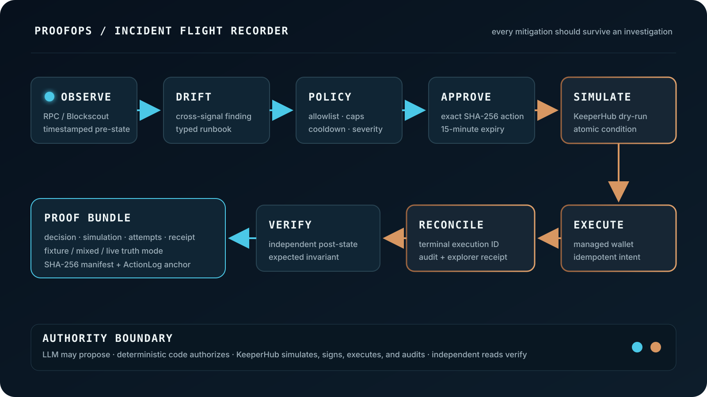
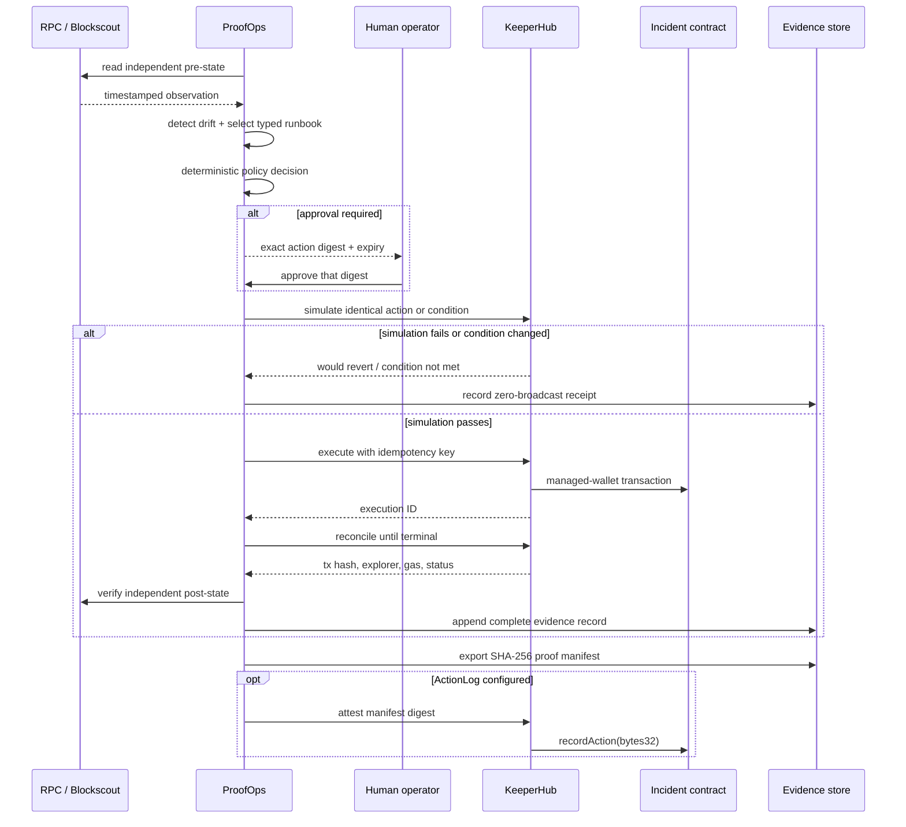

# ProofOps architecture

ProofOps is a bounded incident-response controller whose output is both a
mitigation and an investigation-grade receipt.



## Execution sequence



## Eight flight-recorder stages

| Stage | Question answered | Primary code |
| --- | --- | --- |
| Observe | What was true, from which source, and when? | `src/observe/ReadLayer.ts` |
| Drift | Which invariant changed and how severe is it? | `src/observe/DriftDetector.ts` |
| Policy | Is this exact call within code-enforced authority? | `src/agent/PolicyEngine.ts` |
| Approve | Did a human approve this action before expiry? | `src/agent/ApprovalQueue.ts` |
| Simulate | Would this exact intent revert or fail its condition? | `src/keeperhub/client.ts` |
| Execute | Which managed execution accepted the intent? | `src/keeperhub/execution.ts` |
| Reconcile | Did ambiguity resolve without a duplicate intent? | `src/keeperhub/execution.ts` |
| Verify | Does independent post-state match the intended result? | `src/observe/verifyPostState.ts` |

## Trust boundaries

| Boundary | Authority | Fail-closed behavior |
| --- | --- | --- |
| Observation | external RPC or Blockscout | label fixture data or stop |
| Recommendation | typed runbook only | no runbook means no action |
| Authorization | deterministic policy | blocked reason is persisted |
| Approval | operator, exact digest, 15-minute expiry | missing/mismatch/replay fails |
| Preflight | KeeperHub simulation or atomic condition | no broadcast on revert/change |
| Signing | KeeperHub managed wallet | local signer imports are release failures |
| Recovery | KeeperHub execution ID + idempotency key | reconcile before new intent |
| Evidence | Zod schema + truth invariants | invalid row is quarantined |
| Export | SHA-256 manifest | digest mismatch fails verification |

An LLM may explain ambiguous observations or propose among finite runbooks. It
cannot modify the allowlist, satisfy approval, sign, or authorize a transaction.

## State and evidence

`EvidenceRecord` is append-only JSONL. A record contains the observed inputs,
source timestamps, chosen action, rationale, policy verdict, simulation,
attempts, retry reasons, receipt, pre/post-state, and authoritative links.

Three modes prevent overclaiming:

- `fixture`: no transaction, execution ID, audit URL, explorer link, or
  `confirmed` state is permitted;
- `mixed`: observation may be a fixture, but live execution fields still need a
  complete valid receipt;
- `live`: observation and execution are real.

Malformed historical rows do not disappear silently. They are returned as
read issues, excluded from metrics, and shown as quarantined by the dashboard.

## Write paths

There are two judged state-changing calls:

1. an incident mitigation such as `pause()` or `setHeartbeat(uint256)`;
2. the optional `ActionLog.recordAction(bytes32)` proof attestation.

Both go through `KeeperHubClient`. The Foundry deployer helper is a separate
one-time test-fixture setup path. After deployment, contract ownership is
transferred to the KeeperHub organization wallet.

## Deployment shape

```text
browser
  │ same-origin HTTPS + operator bearer token
  ▼
ProofOps demo server ──► local evidence/proof volume
  │
  ├── read-only ──► RPC / Blockscout
  │
  └── write intent ──► KeeperHub REST ──► managed wallet ──► Sepolia
```

The included container runs as `node`, uses production dependencies only, and
is hardened by Compose with a read-only root filesystem, dropped capabilities,
`no-new-privileges`, and a bounded temporary filesystem.

## Design invariants

1. No judged write bypasses KeeperHub.
2. Policy and approval are deterministic, versioned, and recorded.
3. Simulated and executed intent bodies are equivalent.
4. An unchanged retry reuses the same idempotency key.
5. An ambiguous execution is reconciled before another intent.
6. Fixture data cannot produce a live-looking receipt or link.
7. Metrics always expose their denominators.
8. Proof files are independently hash-verifiable.
